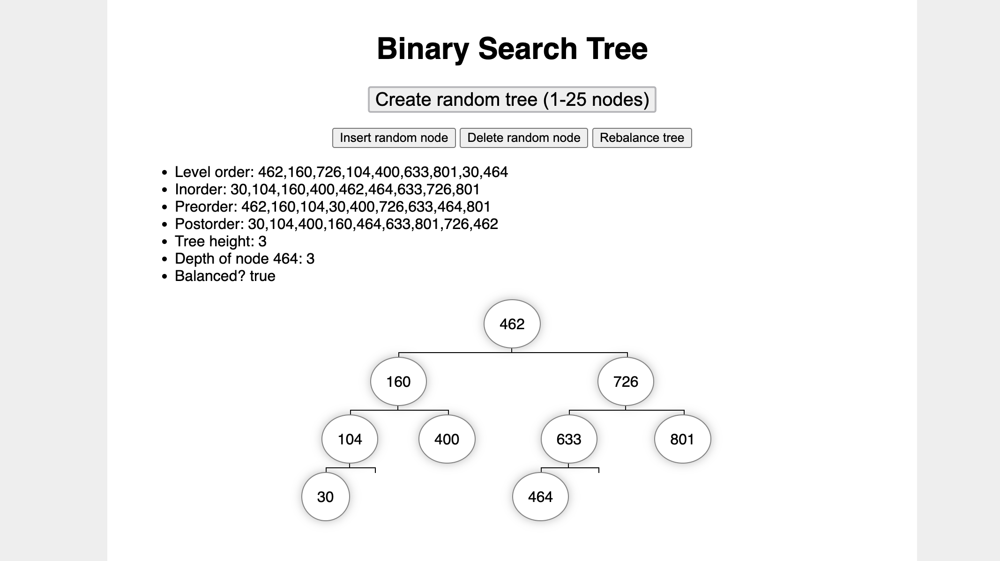

# Binary Search Tree

**Interactive page demonstrating binary search trees**

This is a simple exercise for navigating, analyzing, and editing a binary search tree.

I completed this project as coursework for The Odin Project's Computer Science module ([assignment page](https://www.theodinproject.com/lessons/javascript-binary-search-trees)).

* **Live demo:** https://stephengroe.github.io/top-binary-search-tree/
* **Built with:** Vanilla JS, HTML5, CSS3
* **License:** MIT

## Features

This project includes these functions:

### Generate tree

* `generateArray(length)` - Creates an array of specified length, filled with random integers
* `prepArray(array)` - Sorts the array and removes duplicates
* `generateTree(array)` - Builds a balanced binary tree from the array

### Find, add, and remove nodes

* `insertNode(value)` - Inserts a new node with this value into its position in the tree
* `deleteNode(value)` - Finds the node with this value and deletes it from the tree

* `find(value)` - Finds the node with this value and returns it
* `findParent(value)` - Finds the node with this value and returns its parent and direction (right/left)
* `isLeaf(node)` - Determines if the node is a leaf or not (zero branches)

### Tree analysis and balancing

* `height(node)` - Returns the height of a node (edges in longest path to leaf node)
* `depth(node)` - Returns the depth of a node (edges in path to root)

* `levelOrder(root)` - Outputs tree nodes in an array in breadth-first level order
* `inorder(root)` - Outputs tree nodes in an array in depth-first inorder
* `preorder(root)` - Outputs tree nodes in an array in depth-first preorder
* `postorder(root)` - Outputs tree nodes in an array in depth-first postorder

* `isBalanced(root)` - Determines if the tree is balanced or not
* `rebalance(root)` - Rebalances the tree

### DOM visualization

I added visual elements to make this an interactive DOM page, no console needed. Random values are generated where needed.

## Improvements

* **Add user input.** It'd be nice to let the user search, create, and delete specific nodes.
* **Make functions object methods.** I didn't create the functions as methods on the Tree and Node objects—this would improve readability and extensibility.
* **Prettier formatting.** It's a bit drab—some colors and better layout would help!

Since this was a simple coursework exercise, I probably won't make these improvements anytime soon... but it's nice to dream!